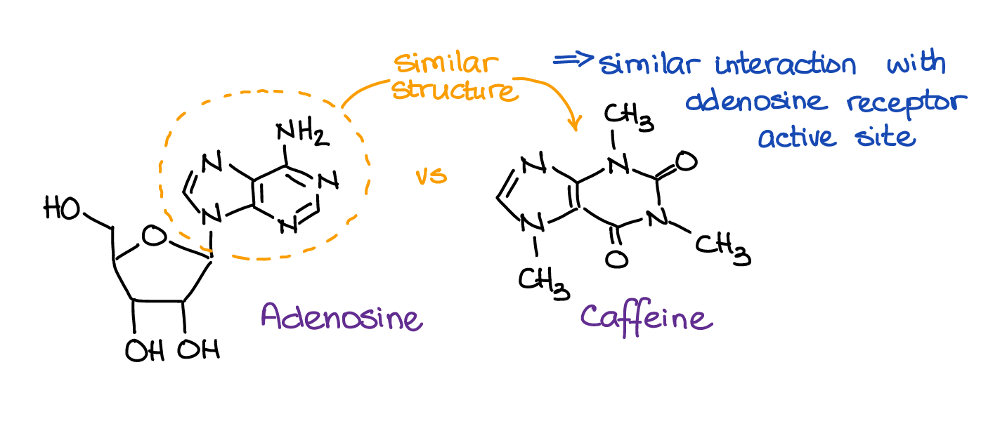

Caffeine causes you to feel less tired, and caffeine is the main ingredient in both coffee and Red Bull. However, Red Bull has *less* caffeine than coffee, so shouldn't coffee be more effective? But clearly, Red Bull feels like it gives you much more energy than coffee does. We'll delve into the science behind caffeine and why Red Bull feels stronger in this post.

Coffee is made of ground coffee beans, which contain caffeine. Basically, sleepiness works by the following process:
- ATP is metabolized by the brain, releasing adenosine throughout the day.
- The brain also has receptors for adenosine. As it builds up, these receptors are activated, and this activation causes you to feel sleepy.

Now, caffeine has a shape similar to adenosine. Therefore, caffeine molecules can go into adenosine receptors and *block* them **without activating them**. This causes less activation of adenosine receptors, and therefore your sleepiness vanishes!

 [Image Credit](https://chemistryhelpcenter.org/)

However, some people quickly develop a tolerance to caffeine due to excessive intake: the brain develops *more* adenosine receptors, meaning you need a larger intake of caffeine before you lose the sensation of sleepiness. You may also just have a fast metabolism and break down the caffeine quickly, causing sleepiness to return soon after your coffee.

Drinking coffee everyday basically masks your tiredness without actually replacing rest. While this may work short-term, it has long term effects on your body, such as insulin resistance (where your cells don't respond well to insulin in the blood), causing increasing blood sugar (this is debated: some studies actually show lower type 2 diabetes risk - interesting, isn't it?); insomnia - caffeine consumed even 6 hours before bed can keep you up; and daytime fatigue.

Red Bull has roughly 75-80 mg of caffeine in 250ml, whereas a standard cup of coffee has 80-140 mg of caffeine in the same volume. Clearly, coffee has a higher caffeine content - then why does an energy drink like Red Bull or Monster give you more energy?

This is caused by a multitude of reasons. The cold temperature is a strong reason, alongside quick intake compared to slow intake of coffee. The massive sugar content of Red Bull is one such reason - a normal can contains 27 grams of sugar, whereas pure coffee completely lacks sugar (its sugar content only comes from added sugar), which is quickly digested and converted to glucose in the bloodstream, causing an energy spike. Studies have shown that the taurine in Red Bull acts as a calming agent, smoothing out the jitters and anxiety that may be caused by caffeine. It also helps reduce muscle fatigue, and therefore increases physical endurance.

The Crash: as your brain metabolizes, even though the caffeine blocks receptors temporarily, large quantities of adenosine build up since you are actively burning energy. When caffeine eventually gets displaced, all this built up adenosine hits at once, causing a massive "crash" - immense tiredness. 

However, in spite of taurine, Red Bull can cause increased heart rate and blood pressure, which in turn can cause a plethora of health issues and diseases. Due to the massive sugar content, there is also a risk of type 2 diabetes, and the acid can damage the enamel of your teeth.

In extreme cases (heavy drink use), taurine can also cause kidney injury, while Vitamin B3 is toxic to the liver in large amounts. Some small studies have also shown that drinking Red Bull increases impulsive / rash decision-making, and drinking too much in one shot can even cause a caffeine overdose - caffeine in large amounts is highly toxic.

Also, both coffee and Red Bull can cause caffeine dependence! This is because drinking them makes your body adapt to them, causing the brain to add more adenosine receptors. When you suddenly quit, there are a LOT more adenosine receptors with nothing to fill them, as mentioned above - so you get tired way easier, causing fatigue, headaches, irritability, poor focus, and low mood. After some weeks, these additional receptors are removed, and you return to your baseline.

In conclusion, an occasional Red Bull or coffee don't hurt for a bad night, but be careful - they are addictive and can have some harmful side effects, especially Red Bull. Sleep is very important, it's the body's way to refuel and prepare for the day ahead. Don't compromise on it unless you have to!

I hope you enjoyed reading this!